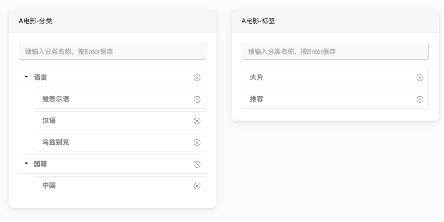
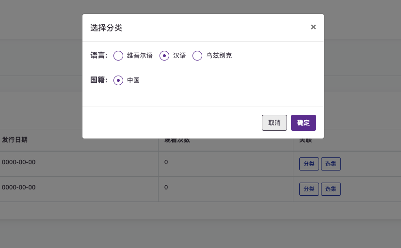

# 分类

实现所有分类相关的功能，在需要用到分类的应用配置里注册一下就可以在相应的模型里面增加分类功能。
例如：在[akino]()应用里这么注册的
```yaml
name: Akino
description: 电影解决方案
email: gheniablez@gmail.com
depends:
    category:
        models:
            -
                name: akino@movie-category
                label: A电影-分类
            -
                name: akino@movie-tags
                label: A电影-标签
```
这样我们在管理后台可以得到这样的界面



`category`提供分类设置模态对话框

